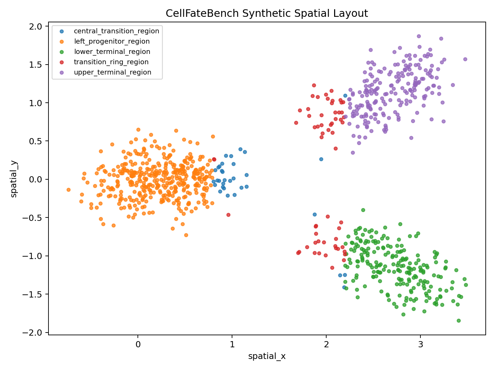
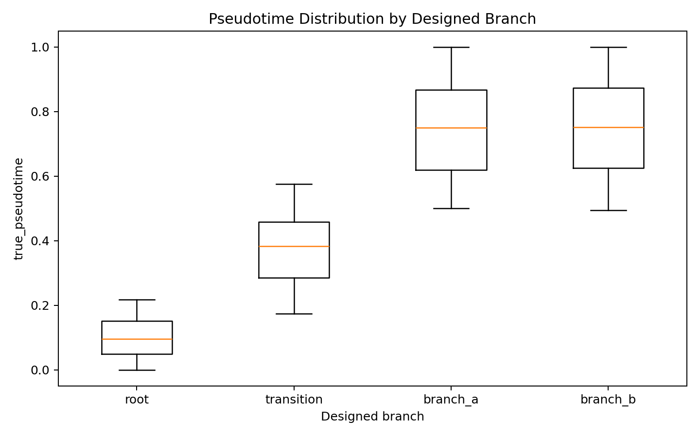
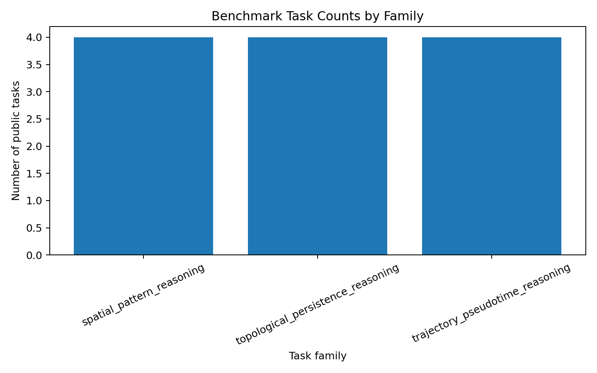
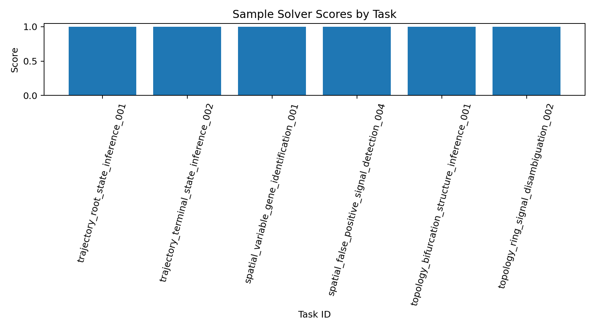
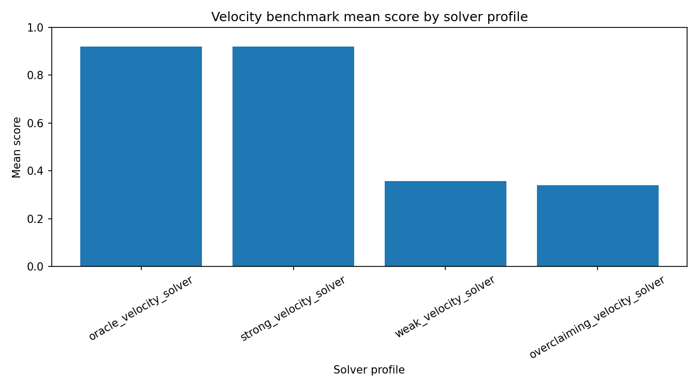
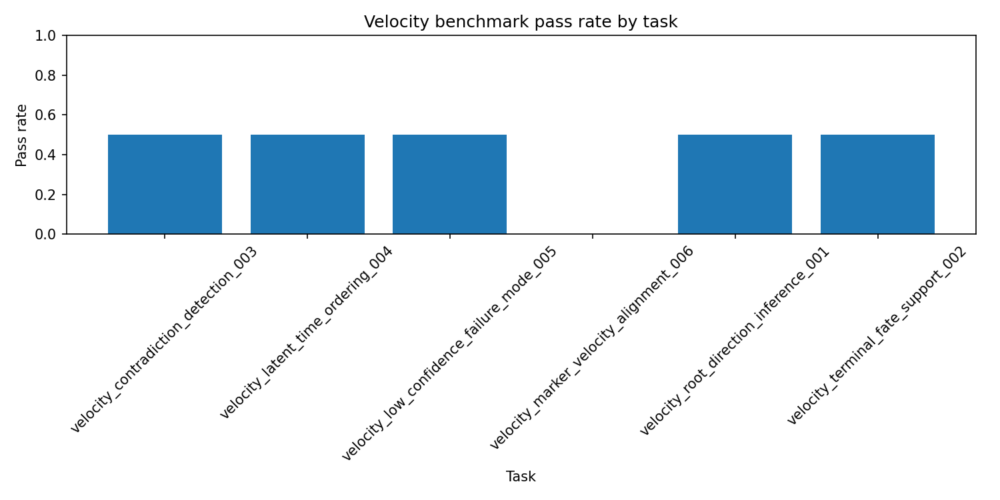
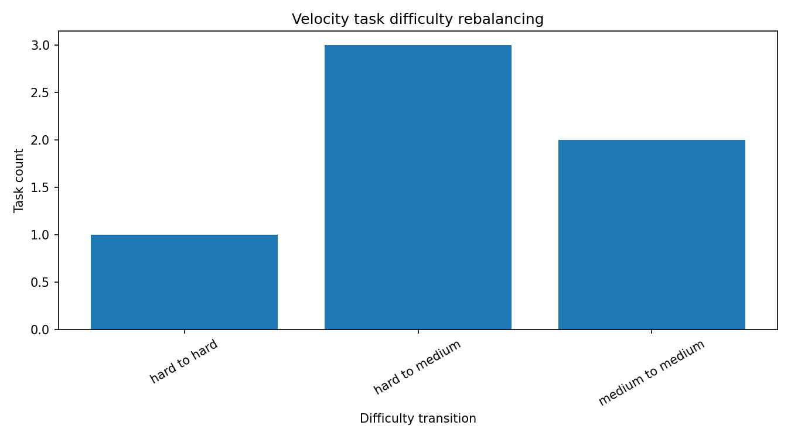

# CellFateBench: Single-Cell Genomics Benchmark for Scientific Reasoning


CellFateBench is a reproducible scientific software and benchmark-design project for evaluating reasoning over single-cell genomics workflows.

The project converts single-cell analysis scenarios into structured benchmark tasks with public prompts, hidden answer keys, oracle outputs, validators, scoring logic, calibration reports, reproducible pipelines, Docker validation, GitHub Actions CI, and reviewer-ready evidence.

Repository:

https://github.com/gbadedata/cellfatebench-single-cell-analysis

## Executive Summary

Single-cell genomics workflows often produce clusters, embeddings, marker tables, pseudotime summaries, spatial patterns, and topology-derived outputs. Those outputs still need interpretation.

CellFateBench focuses on that interpretation layer.

It asks whether a solver can reason correctly from biological and computational evidence, rather than simply return labels or repeat workflow outputs.

The project currently includes two benchmark layers:

| Layer                            | Purpose                                                                                                                                         | Status                 |
| -------------------------------- | ----------------------------------------------------------------------------------------------------------------------------------------------- | ---------------------- |
| v1 controlled benchmark          | Uses synthetic single-cell data with known hidden truth for deterministic evaluation across trajectory, spatial, and topology reasoning tasks   | Complete and validated |
| v2 public RNA velocity extension | Adds a public scVelo pancreas dataset layer, RNA velocity reasoning tasks, solver evaluation, empirical calibration, and difficulty rebalancing | Complete and validated |

The result is a benchmark-engineering project that demonstrates single-cell reasoning, reproducible scientific software, task design, hidden-answer separation, solver evaluation, calibration, Docker reproducibility, and CI validation.

## What This Project Tests

CellFateBench is designed around reasoning questions such as:

* Can a solver infer a root or progenitor state from pseudotime and marker evidence?
* Can a solver recover masked terminal or spatial states?
* Can a solver identify spatially variable gene programmes?
* Can a solver reject unsupported biological interpretations?
* Can a solver distinguish spatial ring evidence from cyclic cell-fate trajectory evidence?
* Can a solver reason about bifurcation, topology, and false-positive loop claims?
* Can a solver interpret RNA velocity context without overclaiming from layer availability alone?
* Can task difficulty be reviewed using solver-performance evidence?

This makes the project closer to scientific evaluation design than a standard single-cell analysis notebook.

## Current Status

| Area                             | Status     |
| -------------------------------- | ---------- |
| v1 controlled benchmark          | Complete   |
| v2 public RNA velocity extension | Complete   |
| Public benchmark tasks           | Present    |
| Hidden answer keys               | Present    |
| Oracle outputs                   | Present    |
| Validators and scoring           | Present    |
| Design-stage calibration         | Present    |
| Empirical v2 calibration         | Present    |
| Difficulty rebalancing           | Present    |
| Docker reproducibility           | Present    |
| GitHub Actions CI                | Passing    |
| Local tests                      | 57 passing |
| v1 pipeline                      | Passing    |
| v2 pipeline                      | Passing    |

## Scope and Use Boundaries

CellFateBench is a research, learning, portfolio, and benchmark-design project.

It is not intended for:

* clinical diagnosis;
* regulated biomedical reporting;
* production laboratory decision-making;
* replacement of expert biological interpretation;
* replacement of experimental validation.

The project is intended to demonstrate how scientific workflows can be converted into reproducible, reviewable, and testable benchmark tasks.

## Why Controlled and Public Data Are Both Used

CellFateBench uses two data strategies because benchmark design and biological realism require different trade-offs.

### v1 controlled synthetic data

The v1 layer uses controlled synthetic single-cell data because deterministic benchmark scoring requires known hidden truth.

Synthetic data allows the project to define:

* root state;
* transition state;
* terminal states;
* branch labels;
* pseudotime values;
* spatial domains;
* spatially variable gene programmes;
* topology design.

This makes hidden-answer evaluation transparent and reproducible.

### v2 public RNA velocity data

The v2 layer adds a public scVelo pancreas RNA velocity dataset to increase biological realism.

The public dataset layer validates:

* 3,696 cells;
* 27,998 genes;
* spliced layer;
* unspliced layer;
* cluster annotation column;
* 8 annotation groups.

The project commits lightweight derived summaries, not large raw public data files.

This follows a best-practice data policy: scripts reproduce public data preparation, while the repository stores only small reviewable outputs.

## Best-Practice Design Principles

CellFateBench follows the following engineering and scientific benchmark practices.

### 1. Separate public prompts from hidden answers

Public benchmark tasks are stored separately from hidden answer keys.

This prevents answer leakage and supports benchmark-style evaluation.

Public tasks:

```
benchmark_tasks/public/
```

Hidden answers:

```
benchmark_tasks/hidden/
```

Oracle outputs:

```
benchmark_tasks/oracle_outputs/
```

### 2. Keep raw public data out of Git

The public scVelo pancreas dataset is loaded through code.

Large raw public data files are not committed. The repository commits only lightweight derived outputs such as dataset summaries, task files, scoring summaries, and figures.

### 3. Preserve deterministic benchmark truth where needed

The v1 synthetic benchmark exists because controlled hidden truth is necessary for deterministic scoring.

Public real data improves realism, but public annotations are treated as reference context rather than absolute biological truth.

### 4. Use transparent scoring

The scoring logic is intentionally inspectable.

The project avoids opaque metrics and documents how correctness, evidence coverage, uncertainty reporting, and overclaiming are handled.

### 5. Document calibration honestly

The v1 calibration is design-stage calibration.

The v2 calibration is empirical sample-solver calibration.

The project does not claim frontier-model calibration because that has not been performed.

### 6. Validate through tests, pipelines, Docker, and CI

The project is validated through:

* pytest;
* Makefile pipeline commands;
* Docker build and execution;
* GitHub Actions CI;
* expected output checks.

### 7. Document limitations instead of hiding them

The project explicitly documents synthetic data limitations, public dataset warnings, calibration scope, and future development areas.

## High-Level Architecture

```
CellFateBench
    |
    |-- v1 controlled benchmark
    |      |
    |      |-- synthetic single-cell dataset
    |      |-- known hidden truth
    |      |-- trajectory tasks
    |      |-- spatial tasks
    |      |-- topology tasks
    |      |-- hidden answers
    |      |-- oracle outputs
    |      |-- validators
    |      |-- scoring
    |      |-- design-stage calibration
    |
    |-- v2 public RNA velocity extension
           |
           |-- public scVelo pancreas dataset summaries
           |-- spliced and unspliced layer validation
           |-- velocity reasoning tasks
           |-- velocity hidden answers
           |-- velocity oracle outputs
           |-- solver profiles
           |-- expanded scoring
           |-- solver performance outputs
           |-- empirical calibration
           |-- difficulty rebalancing
```

## Repository Structure

```
cellfatebench-single-cell-analysis/
├── benchmark_tasks/
│   ├── public/
│   ├── hidden/
│   ├── oracle_outputs/
│   └── calibration_logs/
├── configs/
├── data/
│   ├── raw/
│   ├── processed/
│   ├── reference/
│   └── synthetic/
├── docs/
│   ├── evidence_map.md
│   ├── limitations.md
│   ├── methods.md
│   ├── project_design.md
│   ├── reviewer_guide.md
│   └── v2_velocity_extension_plan.md
├── results/
│   ├── figures/
│   ├── reports/
│   └── tables/
├── sample_solver_answers/
├── scripts/
├── src/cellfatebench/
├── tests/
├── Dockerfile
├── Makefile
├── environment.yml
└── README.md
```

## v1 Controlled Benchmark

The v1 benchmark uses synthetic single-cell data with known hidden truth.

| Feature                | Value |
| ---------------------- | ----: |
| Synthetic cells        |   900 |
| Genes                  |    60 |
| Designed branch labels |     4 |
| Spatial domains        |     5 |
| Terminal states        |     2 |
| v1 task families       |     3 |
| v1 public tasks        |    12 |
| v1 hidden answer keys  |    12 |
| v1 oracle outputs      |    12 |

The v1 layer supports deterministic reasoning tasks across trajectory, spatial, and topology settings.

## v1 Task Families

### 1. Trajectory and pseudotime reasoning

Files:

* `benchmark_tasks/public/trajectory_pseudotime_tasks.json`
* `benchmark_tasks/hidden/trajectory_pseudotime_answers.json`
* `benchmark_tasks/oracle_outputs/trajectory_pseudotime_oracle_outputs.json`

This task family evaluates whether a solver can infer:

* root or progenitor state;
* terminal states;
* transition-state placement;
* early-to-late pseudotime ordering;
* masked terminal-state identity.

### 2. Spatial pattern reasoning

Files:

* `benchmark_tasks/public/spatial_pattern_tasks.json`
* `benchmark_tasks/hidden/spatial_pattern_answers.json`
* `benchmark_tasks/oracle_outputs/spatial_pattern_oracle_outputs.json`

This task family evaluates whether a solver can infer:

* spatially variable gene groups;
* domain-specific marker enrichment;
* masked spatial-domain identity;
* unsupported spatial interpretation claims.

### 3. Topological persistence reasoning

Files:

* `benchmark_tasks/public/topological_persistence_tasks.json`
* `benchmark_tasks/hidden/topological_persistence_answers.json`
* `benchmark_tasks/oracle_outputs/topological_persistence_oracle_outputs.json`

This task family evaluates whether a solver can reason about:

* bifurcating trajectory structure;
* major branch count;
* ring-like spatial signal;
* false-positive loop claims;
* distinction between spatial topology and cell-fate trajectory topology.

The topology layer uses GUDHI to compute lightweight persistence-inspired summaries for benchmark reasoning tasks.

## v2 Public RNA Velocity Extension

The v2 layer extends CellFateBench with a public RNA velocity benchmark extension based on the scVelo pancreas dataset.

The v2 layer adds:

* public RNA velocity dataset preparation;
* spliced and unspliced layer validation;
* velocity dataset summary tables;
* velocity reasoning benchmark tasks;
* velocity hidden answer keys;
* velocity oracle outputs;
* solver profiles;
* expanded velocity scoring;
* solver performance summaries;
* solver performance figures;
* empirical calibration;
* task difficulty rebalancing;
* v2 pipeline orchestration;
* CI and Docker validation.

## v2 Public Dataset Summary

Generated file:

```
results/tables/velocity_dataset_summary.csv
```

Current summary:

| Dataset         | Cells |  Genes | Required layers    | Annotation column | Annotation groups |
| --------------- | ----: | -----: | ------------------ | ----------------- | ----------------: |
| scvelo_pancreas | 3,696 | 27,998 | spliced, unspliced | clusters          |                 8 |

Layer summary:

```
results/tables/velocity_layer_summary.csv
```

| Layer     | Cells |  Genes | Matrix type |
| --------- | ----: | -----: | ----------- |
| spliced   | 3,696 | 27,998 | csr_matrix  |
| unspliced | 3,696 | 27,998 | csr_matrix  |

## v2 Velocity Reasoning Tasks

Files:

* `benchmark_tasks/public/velocity_reasoning_tasks.json`
* `benchmark_tasks/hidden/velocity_reasoning_answers.json`
* `benchmark_tasks/oracle_outputs/velocity_reasoning_oracle_outputs.json`

The v2 benchmark currently includes 6 velocity reasoning tasks:

| Task ID                                    | Difficulty | Focus                                         |
| ------------------------------------------ | ---------- | --------------------------------------------- |
| `velocity_root_direction_inference_001`    | Medium     | Upstream cell-state reasoning                 |
| `velocity_terminal_fate_support_002`       | Medium     | Terminal endocrine fate identification        |
| `velocity_contradiction_detection_003`     | Hard       | Rejection of reversed differentiation claims  |
| `velocity_latent_time_ordering_004`        | Hard       | Reference early-to-late ordering              |
| `velocity_low_confidence_failure_mode_005` | Hard       | Avoiding overclaiming from layer availability |
| `velocity_marker_velocity_alignment_006`   | Hard       | Marker and velocity evidence alignment        |

These tasks are intentionally designed to test reasoning, not simply the ability to run scVelo.

## v2 Solver Evaluation

Solver profiles are stored in:

```
sample_solver_answers/velocity_solver_profiles.json
```

Current solver profiles:

* oracle velocity solver;
* strong velocity solver;
* overclaiming velocity solver;
* weak velocity solver.

Generated outputs:

* `results/tables/velocity_solver_performance_summary.csv`
* `results/tables/velocity_task_performance_summary.csv`
* `results/figures/velocity_solver_score_by_profile.png`
* `results/figures/velocity_task_pass_rate.png`

The v2 evaluation rubric considers:

* answer correctness;
* evidence support;
* uncertainty discipline;
* overclaim penalty.

This gives the benchmark a stronger evaluation layer than task generation alone.

## v2 Empirical Calibration and Difficulty Rebalancing

Generated calibration output:

```
benchmark_tasks/calibration_logs/empirical_velocity_calibration_log.json
```

Generated rebalancing table:

```
results/tables/velocity_task_difficulty_rebalanced.csv
```

Generated figure:

```
results/figures/velocity_task_difficulty_rebalance.png
```

The calibration layer reviews task difficulty against sample solver performance.

Important scope note:

CellFateBench does not claim frontier-model calibration. The v2 calibration is based on local sample solver profiles and is used to demonstrate benchmark-engineering methodology.

## Scoring Methodology

CellFateBench uses transparent scoring rather than opaque evaluation.

The v1 scoring layer supports:

* expected answer matching;
* Boolean claim checking;
* required evidence-term matching;
* confidence reporting;
* partial credit.

The v2 scoring layer adds stronger solver-behaviour evaluation:

* answer correctness;
* evidence support;
* uncertainty discipline;
* overclaim penalty;
* solver-level performance summaries;
* task-level performance summaries.

This makes the benchmark useful for evaluating both correctness and reasoning discipline.

## Calibration Methodology

CellFateBench includes two calibration layers.

| Calibration layer                      | Scope                                                                     | Claim                          |
| -------------------------------------- | ------------------------------------------------------------------------- | ------------------------------ |
| v1 design-stage calibration            | Reviews task difficulty, reasoning requirements, and likely failure modes | Design-stage only              |
| v2 empirical sample-solver calibration | Reviews velocity task difficulty using local solver profiles              | Not frontier-model calibration |

The project is careful not to overstate calibration. Empirical frontier-model calibration would require running the benchmark against actual frontier systems and recording their performance.

## Visual Outputs

Current figures include:

* `results/figures/synthetic_spatial_layout.png`
* `results/figures/pseudotime_by_branch.png`
* `results/figures/task_family_counts.png`
* `results/figures/sample_solver_scores.png`
* `results/figures/velocity_solver_score_by_profile.png`
* `results/figures/velocity_task_pass_rate.png`
* `results/figures/velocity_task_difficulty_rebalance.png`

### Synthetic Spatial Layout



### Pseudotime by Branch



### v1 Task Family Counts



### v1 Sample Solver Scores



### v2 Velocity Solver Scores



### v2 Velocity Task Pass Rate



### v2 Difficulty Rebalancing



## Reproducibility Model

The project is designed to be reproducible through four layers.

| Layer             | Purpose                                                                  |
| ----------------- | ------------------------------------------------------------------------ |
| Conda environment | Recreates scientific Python dependencies                                 |
| Makefile commands | Provides stable entry points for tests and pipelines                     |
| Docker            | Validates execution in a clean container                                 |
| GitHub Actions CI | Validates tests, v1 pipeline, v2 pipeline, and Docker execution remotely |

## Environment Setup

Clone the repository:

```
git clone https://github.com/gbadedata/cellfatebench-single-cell-analysis.git
cd cellfatebench-single-cell-analysis
```

Create the environment:

```
conda env create -f environment.yml
conda activate cellfatebench
```

Run the test suite:

```
make test
```

Run the v1 pipeline:

```
make pipeline
```

Run the v2 public RNA velocity pipeline:

```
make pipeline-v2
```

## Makefile Commands

| Command                     | Purpose                                                      |
| --------------------------- | ------------------------------------------------------------ |
| `make test`                 | Run all tests                                                |
| `make dataset`              | Generate the v1 synthetic dataset                            |
| `make trajectory`           | Generate trajectory and pseudotime tasks                     |
| `make spatial`              | Generate spatial pattern tasks                               |
| `make topology-summary`     | Generate topology summary                                    |
| `make topology-tasks`       | Generate topology tasks                                      |
| `make calibration`          | Generate v1 design-stage calibration log                     |
| `make score`                | Score v1 sample solver answers                               |
| `make pipeline`             | Run the full v1 benchmark pipeline                           |
| `make velocity-data`        | Prepare public RNA velocity dataset summaries                |
| `make velocity-tasks`       | Generate v2 velocity reasoning tasks                         |
| `make velocity-evaluate`    | Evaluate v2 velocity solver profiles                         |
| `make velocity-calibration` | Generate v2 empirical calibration and difficulty rebalancing |
| `make pipeline-v2`          | Run the full v2 public RNA velocity pipeline                 |

## Docker Reproducibility

Build the Docker image:

```
docker build -t cellfatebench:latest .
```

Run tests inside Docker:

```
docker run --rm cellfatebench:latest make test
```

Run the v1 pipeline inside Docker:

```
docker run --rm cellfatebench:latest make pipeline
```

Run the v2 pipeline inside Docker:

```
docker run --rm cellfatebench:latest make pipeline-v2
```

## GitHub Actions CI

The CI workflow validates:

* test suite;
* v1 benchmark pipeline;
* v2 public RNA velocity pipeline;
* expected v1 outputs;
* expected v2 outputs;
* Docker build;
* Docker test execution;
* Docker v1 pipeline execution;
* Docker v2 pipeline execution.

Workflow file:

```
.github/workflows/ci.yml
```

## Testing Strategy

The test suite covers:

* synthetic dataset generation;
* trajectory task generation;
* spatial task generation;
* topology summary generation;
* topology task generation;
* v1 scoring;
* v1 calibration;
* v1 pipeline orchestration;
* visual output generation;
* public RNA velocity layer validation;
* velocity task generation;
* velocity solver evaluation;
* velocity empirical calibration;
* v2 pipeline orchestration.

Current status:

```
57 passed
```

The public scVelo pancreas dataset can emit AnnData format warnings because the source file uses older H5AD metadata conventions. These warnings are documented and do not indicate failure of CellFateBench logic.

## Key Outputs

### v1 outputs

* `data/synthetic/synthetic_cell_metadata.csv`
* `data/synthetic/synthetic_expression_matrix.csv`
* `data/synthetic/synthetic_gene_metadata.csv`
* `data/synthetic/synthetic_hidden_truth.json`
* `results/tables/topology_summary.json`
* `results/reports/sample_solver_score_report.json`
* `results/tables/benchmark_task_summary.csv`

### v2 outputs

* `results/tables/velocity_dataset_summary.csv`
* `results/tables/velocity_layer_summary.csv`
* `results/tables/velocity_solver_performance_summary.csv`
* `results/tables/velocity_task_performance_summary.csv`
* `results/tables/velocity_task_difficulty_rebalanced.csv`
* `benchmark_tasks/calibration_logs/empirical_velocity_calibration_log.json`

## Documentation

Additional documentation:

* `docs/methods.md`
* `docs/evidence_map.md`
* `docs/reviewer_guide.md`
* `docs/limitations.md`
* `docs/project_design.md`
* `docs/v2_velocity_extension_plan.md`

Recommended reviewer path:

1. Read this README.
2. Inspect `docs/methods.md`.
3. Inspect `docs/evidence_map.md`.
4. Inspect public tasks in `benchmark_tasks/public/`.
5. Inspect hidden answers in `benchmark_tasks/hidden/`.
6. Inspect oracle outputs in `benchmark_tasks/oracle_outputs/`.
7. Run `make test`.
8. Run `make pipeline`.
9. Run `make pipeline-v2`.
10. Run Docker validation if a container-level check is required.

## Scientific and Engineering Capabilities Demonstrated

CellFateBench demonstrates:

* single-cell genomics benchmark design;
* public and controlled data strategies;
* RNA velocity dataset handling;
* AnnData layer validation;
* trajectory and pseudotime reasoning;
* spatial pattern reasoning;
* topology-aware reasoning with GUDHI;
* hidden answer key design;
* oracle output design;
* deterministic validation;
* partial-credit scoring;
* overclaim detection;
* solver profile evaluation;
* empirical sample-solver calibration;
* task difficulty rebalancing;
* reproducible pipelines;
* Docker execution;
* GitHub Actions CI;
* technical documentation;
* evidence-based repository structure.

## Limitations

CellFateBench is intentionally honest about its current limitations.

* v1 uses synthetic data to support deterministic hidden-truth evaluation.
* v2 uses public dataset reference annotations, not absolute biological truth.
* v2 currently validates RNA velocity inputs and reasoning tasks, but does not yet compute a full scVelo velocity graph inside the benchmark pipeline.
* Empirical calibration is based on local sample solver profiles, not frontier-model runs.
* The topology layer is lightweight and benchmark-oriented.
* The project is not intended for clinical or diagnostic use.

## Roadmap

Planned future improvements include:

* full scVelo velocity graph computation;
* latent time summaries;
* gene-level velocity confidence summaries;
* real solver runs against multiple AI systems;
* human expert calibration;
* expanded family-specific scoring rubrics;
* richer persistence diagrams;
* spatial-neighbourhood reasoning with Squidpy;
* multi-omic integration tasks;
* benchmark release versioning;
* structured benchmark metadata schema;
* optional dashboard application after static outputs are mature.

## Project Outcome

CellFateBench is a complete benchmark-design project for single-cell genomics reasoning.

It shows how controlled and public single-cell workflows can be transformed into structured evaluation assets: public tasks, hidden answers, oracle outputs, validators, scoring reports, calibration logs, difficulty rebalancing outputs, reproducible pipelines, Docker validation, CI checks, and reviewer-ready documentation.

The project is designed to be inspectable, reproducible, honest about scope, and suitable for technical review.
